 

## About me

I am a Portuguese IT and web development professional based in Braunschweig, Germany. I enjoy building practical software, automating repetitive work and turning ideas into working products.

- Open to remote opportunities and IT training positions
- Interested in web development, automation, local AI tools and technical support
- Currently improving my German and English

## Tech stack

          

## Featured projects

| Project | What it does | Main technologies |
| --- | --- | --- |
| [Cortex AI](https://github.com/LORD998/Cortex-AI) | Local Windows voice assistant powered by Ollama, with a PyQt6 interface and system automation modules. | Python, PyQt6, Ollama |
| [Auto Video Publisher](https://github.com/LORD998/auto-video-publisher) | Automates video publishing workflows for YouTube, Instagram and TikTok. | Python, APIs, automation |
| [Boost AI Server](https://github.com/LORD998/boost-ai-server) | Backend for an AI-powered productivity tool. | TypeScript, Node.js, APIs |
| [Sites Model](https://github.com/LORD998/Sites-model) | Reusable website templates for freelance projects. | HTML, CSS, web development |

## GitHub activity

<picture>
<source media="(prefers-color-scheme: dark)" srcset="https://raw.githubusercontent.com/LORD998/LORD998/output/github-contribution-grid-snake-dark.svg" />
<source media="(prefers-color-scheme: light)" srcset="https://raw.githubusercontent.com/LORD998/LORD998/output/github-contribution-grid-snake.svg" />

</picture>

## Languages

- Portuguese — native
- German — A1
- English — basic
- Spanish and French — basic

Building useful things, one commit at a time.

